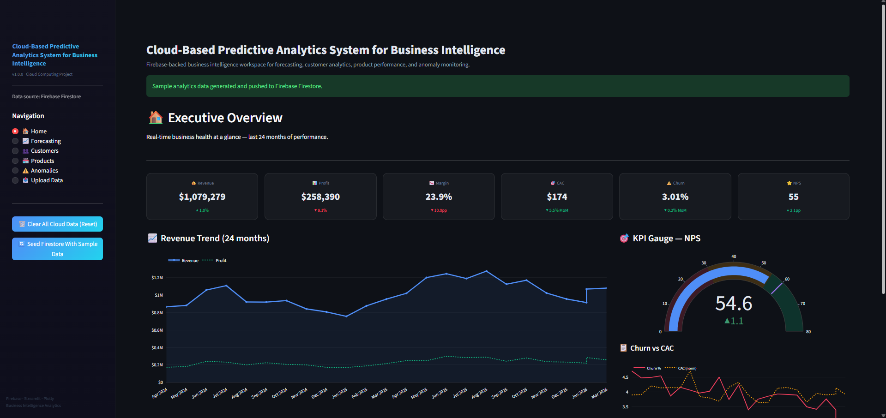
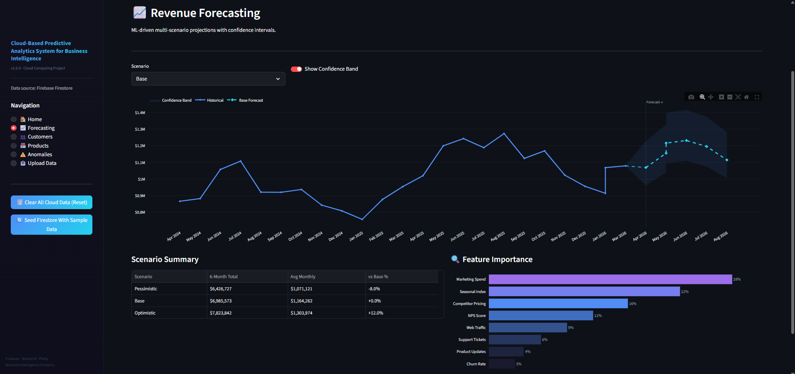
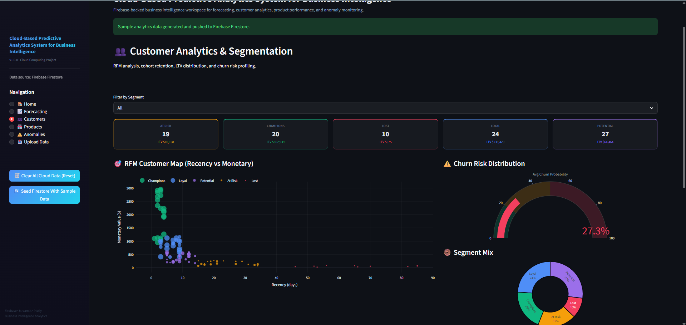
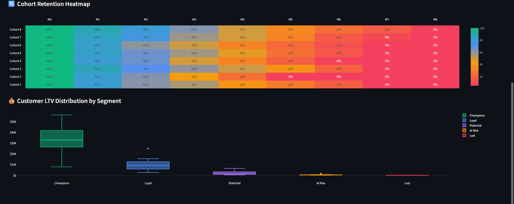
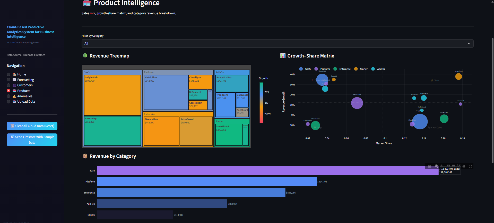
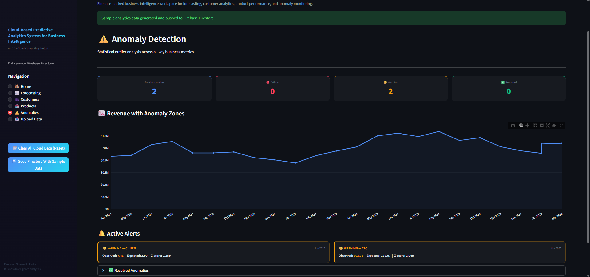
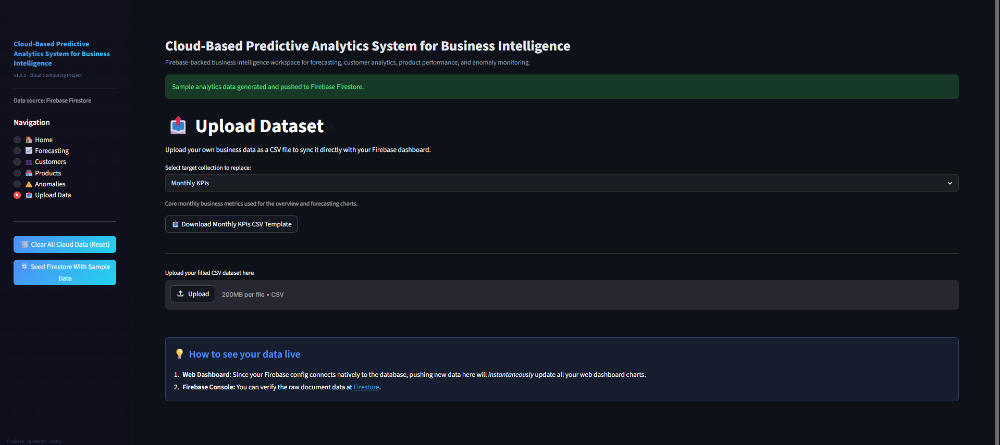
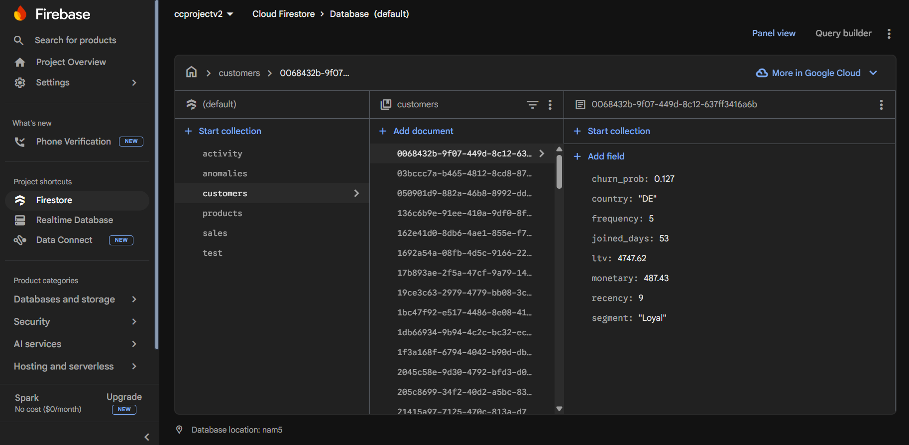

# Cloud-Based Predictive Analytics System for Business Intelligence

A cloud-powered business intelligence platform designed to analyze, monitor, and forecast key business metrics using real-time cloud data.  
The system integrates **Python, Streamlit, and Firebase Firestore** to deliver interactive dashboards, predictive analytics, and anomaly detection for business decision-making.

---

## Project Overview

This project provides a **cloud-based analytics environment** where business data can be uploaded, processed, and visualized through an interactive dashboard.

The system supports:

• Real-time business KPI monitoring  
• Revenue forecasting with scenario modeling  
• Customer segmentation and churn risk analysis  
• Product performance analytics  
• Statistical anomaly detection  
• Cloud database integration using Firebase Firestore

All analytics modules are connected to a **cloud-hosted Firestore database**, enabling scalable and real-time data access.

---

## Key Features

### Executive Business Dashboard
Provides an overview of key business performance metrics including:

- Revenue
- Profit
- Profit Margin
- Customer Acquisition Cost (CAC)
- Customer Churn Rate
- Net Promoter Score (NPS)

---

### Revenue Forecasting
Machine learning–driven revenue forecasting using historical business data.

Features include:

- Historical revenue trend visualization
- Forecast projections
- Scenario analysis (Base, Optimistic, Pessimistic)
- Confidence interval bands
- Feature importance analysis

---

### Customer Analytics & Segmentation

Customer intelligence module powered by behavioral metrics.

Includes:

- RFM (Recency, Frequency, Monetary) segmentation
- Customer Lifetime Value (LTV) analysis
- Cohort retention heatmap
- Churn probability modeling
- Segment distribution visualization

Customer segments include:

- Champions
- Loyal
- Potential
- At Risk
- Lost

---

### Product Intelligence

Product performance analytics dashboard.

Includes:

- Revenue contribution treemap
- Growth-share matrix (BCG style analysis)
- Category-wise revenue distribution
- Product performance comparison

---

### Anomaly Detection

Automatically detects statistical outliers in business metrics.

Capabilities:

- Revenue anomaly identification
- Churn spikes
- Customer acquisition anomalies
- Alert system for abnormal business patterns

---

### Cloud Data Upload

Users can upload business datasets directly into the cloud database.

Features:

- CSV dataset upload
- Automatic synchronization with Firebase Firestore
- Real-time dashboard updates

---

## Cloud Architecture

The system follows a cloud-enabled analytics architecture:

User Interface (Streamlit Dashboard)  
↓  
Python Analytics Engine  
↓  
Firebase Admin SDK  
↓  
Google Cloud Firestore Database  
↓  
Real-time Data Retrieval & Visualization

This architecture enables scalable and real-time analytics processing.

---
# Dashboard Preview

## Executive Overview Dashboard

This dashboard provides a high-level overview of business performance including revenue, profit, margin, CAC, churn rate, and NPS with real-time visualization of business metrics.

---

## Revenue Forecasting

The forecasting module predicts future revenue trends using historical data. It includes scenario analysis (base, optimistic, pessimistic) and confidence intervals to support strategic planning.

---

## Customer Analytics & Segmentation

### Customer Insights

This module analyzes customer behavior using RFM metrics (Recency, Frequency, Monetary) and provides churn probability analysis.

### Cohort & LTV Analysis

Advanced customer analytics including cohort retention heatmaps and customer lifetime value distribution across segments.

---

## Product Intelligence

Product performance analytics including revenue treemaps, category breakdowns, and growth-share matrix visualization.

---

## Anomaly Detection

Statistical anomaly detection identifies unusual patterns in revenue, churn, and other business metrics to help detect risks and unexpected changes.

---

## Dataset Upload (Cloud Integration)

Users can upload CSV datasets directly through the dashboard which automatically syncs with the Firebase cloud database.

---

## Firebase Cloud Database

The platform uses **Google Firebase Firestore** as the cloud database for storing customer, sales, and product data, enabling real-time analytics and scalable cloud infrastructure.

## Technology Stack

| Category | Technologies |
|--------|--------|
| Programming | Python |
| Dashboard Framework | Streamlit |
| Data Processing | Pandas, NumPy |
| Visualization | Plotly |
| Cloud Database | Firebase Firestore |
| Backend Integration | Firebase Admin SDK |
| Machine Learning | Scikit-learn |
| Data Storage | Cloud Firestore |

---

## Project Structure

Cloud-Based-Predictive-Analytics-System-for-Business-Intelligence
│
├── dashboard/                     # Streamlit dashboard UI
│   ├── home.py                    # Executive overview dashboard
│   ├── forecasting.py             # Revenue forecasting module
│   ├── customers.py               # Customer analytics & segmentation
│   ├── products.py                # Product intelligence dashboard
│   ├── anomalies.py               # Anomaly detection module
│   └── upload_data.py             # Dataset upload interface
│
├── python_backend/                # Python analytics engine
│   ├── data_processing.py         # Data cleaning & preprocessing
│   ├── forecasting_model.py       # Revenue prediction logic
│   ├── customer_segmentation.py   # RFM analysis & customer segmentation
│   ├── anomaly_detection.py       # Statistical anomaly detection
│   └── utils.py                   # Helper functions
│
├── firebase/                      # Firebase cloud integration
│   ├── firebase_config.js         # Firebase configuration
│   ├── firestore.rules            # Database security rules
│   └── firestore.indexes.json     # Firestore indexes
│
├── screenshots/                   # Dashboard screenshots for README
│   ├── home.png
│   ├── revenue.png
│   ├── customer1.png
│   ├── customer2.png
│   ├── product.png
│   ├── anomaly.png
│   ├── dataset_upload.png
│   └── firebase.png
│
├── .gitignore                     # Git ignored files
├── requirements.txt               # Python dependencies
├── LICENSE                        # MIT license
└── README.md                      # Project documentation
